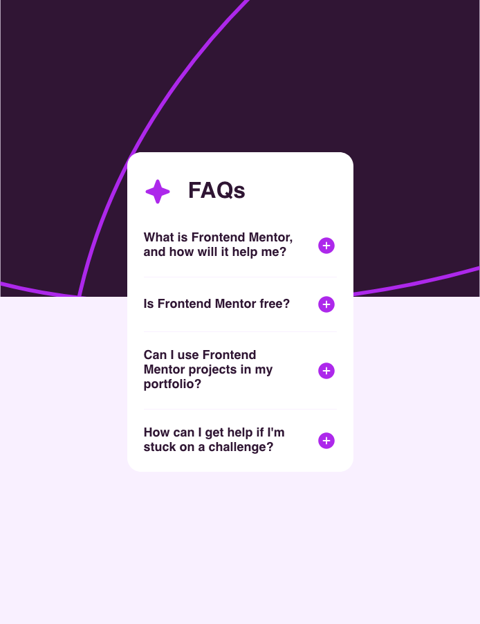

# Frontend Mentor - FAQ accordion solution

This is a solution to the [FAQ accordion challenge on Frontend Mentor](https://www.frontendmentor.io/challenges/faq-accordion-wyfFdeBwBz). Frontend Mentor challenges help you improve your coding skills by building realistic projects. 


## Overview

### The challenge

Users should be able to:

- Hide/Show the answer to a question when the question is clicked
- Navigate the questions and hide/show answers using keyboard navigation alone
- View the optimal layout for the interface depending on their device's screen size
- See hover and focus states for all interactive elements on the page

### Screenshot



### Links

- Solution URL: [https://bdeweer.github.io/faq-accordion/](https://bdeweer.github.io/faq-accordion/)
- Live Site URL: [https://bdeweer.github.io/faq-accordion/](https://bdeweer.github.io/faq-accordion/)

## My process


### What I learned


```css
li {
  padding-block: $spacing-300;

  &.open {
    padding-block-end: 0;

    .answer {
      display: block;
      padding-block: $spacing-300;
    }
  }

  .answer {
    display: none;
  }
}
```
```js
const buttons = document.querySelectorAll("button");

buttons.forEach((button) => {
  button.addEventListener("click", () => {
    const img = button.querySelector("img");
    const isOpen = button.closest("li").classList.toggle("open");

    img.src = isOpen ? button.dataset.iconMinus : button.dataset.iconPlus;
  });
});

```

## Author

- Website - [Add your name here](https://www.your-site.com)
- Frontend Mentor - [@yourusername](https://www.frontendmentor.io/profile/yourusername)
- Twitter - [@yourusername](https://www.twitter.com/yourusername)